# IntelliLoop Architecture - Release Candidate Plus Optional IL-10.3

**Audience:** Developers and technical reviewers  
**Status:** `IL-9.3_DOCUMENTATION_SYNCHRONIZED / DEMO_RUN_2_LOCAL_PILOT`  
**Stories:** implemented topology through the controlled Phase-8 workflow; release documentation through `IL-9.3`; default-off optional experiments through `IL-10.3`; default-off allowlisted Local Project Pilot through Demo Run 2  
**Evidence date:** 2026-08-08

## Implemented topology

```mermaid
flowchart LR
    Env["Typed process environment"] --> Config["Fail-closed API configuration"]
    Shell["Accessible React Project, evidence, Twin, reconciliation, explanation and readiness routes"] -->|"Versioned JSON via local proxy"| Api["Fastify API - loopback only"]
    Shell --> EvidenceView["Strict evidence and timeline presentation"]
    EvidenceView -->|"Preview, commit and bounded lineage reads"| EvidenceRoutes
    Shell --> ReconciliationView["Strict findings and cited-impact presentation"]
    ReconciliationView -->|"Explicit run and bounded immutable reads"| ReconciliationRoutes
    Shell --> ExplanationView["Strict AI-off answer, disclosure and citation presentation"]
    ExplanationView -->|"One of six fixed questions"| ExplanationRoutes["Cited-explanation route"]
    Shell --> ReadinessView["Exact readiness and unsigned Passport presentation"]
    ReadinessView -->|"Repository-derived commands and bounded history"| ReadinessRoutes["Mission-scoped readiness and Passport routes"]
    Config --> Api
    Api --> Contracts["@intelliloop/contracts"]
    Api --> Domain["@intelliloop/domain"]
    Api --> ReadinessRoutes
    ReadinessRoutes --> ReadinessService["Repository-derived assessment service"]
    ReadinessRoutes --> PassportService["One-assessment Passport service"]
    ReadinessService --> Database
    PassportService --> Database
    DemoView["Controlled /demo operator route"] -->|"Body-free fixed transitions"| DemoRoutes["Synthetic demo routes"]
    DemoRoutes --> DemoService["Owned fixture setup, correction, staleness and scoped reset"]
    DemoService --> Database
    DemoService --> GeneratedRepo["Owned generated Git repository only"]
    Domain --> TwinVocabulary["twin-vocabulary.v1 - domain only"]
    Domain --> ReconcileComparison["reconciliation-rules.v1 - pure pairwise comparison"]
    ReconcileComparison --> ReconcileFindings["reconciliation-decision-policy.v1 - pure active findings"]
    TwinVocabulary --> TwinProjection["twin-projection.v1 - immutable domain revisions"]
    ReconcileFindings --> Reassessment["reconciliation-reassessment.v1 - pure stale/missing successor evaluation"]
    TwinProjection --> Reassessment
    Reassessment --> Impact["impact-analysis.v1 - bounded cited traversal and exact gaps"]
    TwinProjection --> Impact
    CodeMapProjection --> Impact
    Impact --> ReconciliationRevision["reconciliation-impact-revision.v1 - immutable aggregate"]
    Reassessment --> ReconciliationRevision
    Api --> ReconciliationRoutes["Mission-scoped reconciliation revision routes"]
    ReconciliationRoutes --> ReconciliationService["Exact persisted-input reconstruction"]
    ReconciliationService --> ReconciliationRevision
    ReconciliationRevision --> ReconciliationRepository["Append-only reconciliation repository"]
    ReconciliationRepository --> Database
    Api --> EvidenceRoutes["Mission-scoped evidence, claim and runtime-observation routes"]
    EvidenceRoutes --> Import["Pure evidence preparation"]
    Import --> Domain
    Import --> EvidenceRepository["Attributed evidence repository"]
    EvidenceRepository --> Database
    EvidenceRepository --> ClaimIntake["Bounded structured claim intake"]
    ClaimIntake --> Domain
    ClaimIntake --> ClaimRepository["Immutable claim and supersession repository"]
    ClaimRepository --> Database
    EvidenceRoutes --> ObservationIntake["Bounded historical runtime-summary intake"]
    ObservationIntake --> Import
    ObservationIntake --> EvidenceRepository
    EvidenceRepository --> ObservationProjection["Immutable runtime-observation projection"]
    ObservationProjection --> Database
    Api --> Logs["Safe JSON-line logs"]
    Api --> Repository["Project/Mission repository"]
    Api --> LocalPilot["Default-off allowlisted Local Project preflight"]
    LocalPilot --> Registration["Canonical repository registration"]
    Registration --> Fs["Filesystem metadata only"]
    Api --> CodeMapScanner["Bounded exact-commit code-map reader"]
    CodeMapScanner --> Registration
    CodeMapScanner --> SafeFiles["Committed read-only TS/JS/JSON blobs"]
    SafeFiles --> CodeMapExtractor["Bounded static TypeScript/JSON extractor"]
    CodeMapExtractor --> StaticFacts["Transient syntax-only result"]
    StaticFacts --> CodeMapProjection["Snapshot-bound source-free code-map projection"]
    Fixtures["@intelliloop/demo-fixtures - explicit declared fallback"] -. "controlled only" .-> CodeMapProjection
    CodeMapProjection --> Database
    CodeMapProjection --> TwinProjection
    Api --> Snapshot["Immutable Git snapshot service"]
    Snapshot --> Registration
    Snapshot --> Git["Fixed read-only Git operations"]
    Snapshot --> Database
    Registration --> Database
    Repository --> Database["API-owned SQLite - schema and revision history"]
    Shell --> Contracts
    Contracts --> Domain
```



The API and web application share one versioned health response. Service health is operational truth only; it is never release readiness.

The API opens and migrates its SQLite file before binding the HTTP listener. A migration or schema-integrity failure produces one non-revealing startup code and prevents the service from listening. The browser, contracts and domain packages never open SQLite.

## Safety and observability boundary

Startup configuration is parsed before the server is created. The host can only resolve to `127.0.0.1`; the port must be an integer from 1 through 65535; the log level must be `silent`, `error` or `info`. Invalid values produce one fixed `CONFIG_INVALID` startup record and exit 1 without echoing the supplied value.

Request IDs are UUIDs. A valid inbound `x-request-id` is propagated; malformed or unsafe values are discarded and replaced. Every response, including stable errors, carries the resolved ID.

The stable error envelope is:

```json
{
  "error": {
    "version": "v1",
    "code": "NOT_FOUND",
    "message": "The requested resource was not found.",
    "requestId": "123e4567-e89b-42d3-a456-426614174000"
  }
}
```

Current codes are `NOT_FOUND`, `INVALID_REQUEST`, `CONFLICT`, `INTEGRITY_ERROR` and `INTERNAL_ERROR`. Raw exceptions, URLs, query values, request bodies, headers, environment values and absolute paths are not included.

Structured logging uses an authored allowlist: UTC time, level, event, request ID, method, static route template, status, stable error code, host and port. Fastify's automatic request logger remains disabled.

## Frozen feature defaults

| Flag | Default | Current meaning |
|---|---:|---|
| `ai.externalCalls` | `false` | No provider call is permitted |
| `codeMap.enabled` | `true` | Bounded scan, static extraction, snapshot-bound persistence and attributed list review are implemented |
| `localProjectPilot.enabled` | `false` | Requires a non-empty process-local allowlist; enables preflight/registration/context only for path-aware contained local Git roots |
| `experiments.evidenceReplay` | `false` | Optional read-only immutable Twin comparison; enabled only by the aligned API/web opt-in or `npm.cmd run dev:replay` |
| `experiments.agentDisagreement` | `false` | Optional browser-local import comparison; enabled only by aligned API/web opt-in or `npm.cmd run dev:disagreement` |
| `experiments.remediationPreview` | `false` | Optional browser-local cited test-plan/change-intent preview; enabled only by aligned opt-in or `npm.cmd run dev:remediation` |

External AI remains protected-off and rejects enablement. All three experiments and the separate Local Project Pilot accept only exact `true`/`false` values and default off. The pilot additionally requires a non-empty server allowlist that is never returned to the browser. Evidence Replay is GET-only; disagreement and remediation preview operate only in browser memory. Remediation proposals have cited fixed labels and no repository, shell, Git, network, provider, persistence, validation, readiness or Passport authority.

## Web trust-state boundary

The web application has nine implemented routes: Project selection at `/`, the default-off Local Project workflow at `/local-pilot`, selected Project change overview at `/projects/:projectId`, Mission evidence/timeline at `/missions/:missionId/evidence`, the attributed Twin at `/missions/:missionId/twin`, findings/impact review at `/missions/:missionId/reconciliation`, cited explanation at `/missions/:missionId/explanation`, readiness/Passport at `/missions/:missionId/passport`, and the fixed synthetic control room at `/demo`. Its semantic shell includes a skip link, primary navigation, visible focus and current-route treatment. Lightweight browser-history routing keeps this boundary dependency-free and does not fabricate later route content.

The Projects route retrieves and creates real persisted Project resources and presents distinct Demo and Local entries. The Local route first checks capability, accepts one explicitly configured path for preflight, displays only safe ref/commit/exclusion metadata, then reuses Project, Mission, registration, snapshot, code-map, Twin, reconciliation, readiness and Passport services. The change overview retrieves the exact Project, its current Mission, optional path-free registration and immutable snapshots; arbitrary path registration is no longer exposed there. Page reload reconstructs the view from persisted API resources rather than browser sample data.

The shell exposes these explicit states through text and structure, not color alone:

| State | Current meaning |
|---|---|
| `LOADING` | Waiting for the local health or workspace contract |
| `CONNECTED` | Browser and API contract agree; never readiness |
| `ERROR` | Local API request or contract failed; no cached substitute |
| `EMPTY` | No persisted Project, current Mission, registration or snapshot exists at that workflow stage |
| `AI_OFF` | No credential is read and no evidence is transferred |

Network failure retains the shell and scope disclosure. The retry control performs a fresh local request. Strict browser validators reject malformed success resources, and the client never converts an unavailable response, sample object or placeholder into a connected or green state.

The repository root crosses the browser boundary only as the preflight/registration body. It is hidden after successful preflight and cleared after registration; only display name, actual ref, exact commit, commit time, excluded-change count, registration kind/access and recorded time remain. The configured allowlist never crosses the server boundary. Snapshot cards render path-free counts and digest with `NOT ASSESSED`, observation-only and not-a-readiness-decision labels.

The evidence route retrieves the exact Mission and four bounded collections from the local API. Its client validators accept only exact resource shapes and known version/origin/label/redaction values, then perform cross-resource scope and lineage checks before render. An invalid success payload produces one explicit `INTEGRITY ERROR`; the UI does not retain a plausible subset. A 100-record page is visibly marked partial when any continuation cursor exists.

Preview uses the API's deterministic prepared representation and remains in component memory. Import remains disabled unless that preview exactly matches the current format/content draft; commit sends the raw draft so the server repeats preparation. Successful import clears raw content and preview, reloads authoritative collections and reports whether the immutable source/event was created or reused. Source, event, claim and supersession panels expose persisted attribution but no browser claim authoring, inference, conflict winner or readiness control.

## Deterministic primitive boundary

`@intelliloop/domain` now owns pure primitives for canonical JSON, UTF-8 SHA-256 digests, branded UUID v4 stable IDs and injected UTC clocks. It imports no application, framework, database or contract package. Hashing uses the standard Web Crypto API available in the pinned Node runtime and browsers; it makes no network call.

`@intelliloop/contracts` depends on those primitives to construct and exhaustively serialize generic record metadata. The contract preserves stable record identity, project/mission scope, origin, source reference, source revision or content digest, recorded/effective time, extraction method and `FACT`/`INFERENCE` label. Project and Mission ID types now originate in the domain package so contracts cannot create a second identity authority.

## Project and Change Mission boundary

`@intelliloop/domain` owns immutable `Project` and `ChangeMission` entities. A Project is `ACTIVE` or terminally `ARCHIVED`; a mission is `CURRENT` or terminally `ARCHIVED`. Creation starts at revision 1, archive returns a new frozen revision, and injected ID/clock sources keep every transition deterministic.

Current-mission selection is derived from the exact project-scoped mission collection rather than duplicated on the Project. The domain rejects cross-project references, duplicate mission identities, multiple current missions, non-monotonic lifecycle time, forged entity state and Project archival while a current mission exists. A new mission becomes current only after the prior current mission is archived and retained in history.

The API repository hydrates this domain authority from immutable revision rows and advances transactional head rows. The versioned JSON routes create and retrieve Projects and missions without duplicating lifecycle rules. The `IL-2.5` UI consumes those resources without becoming a second domain authority.

## Read-only Git observation boundary

Repository registration privately owns the canonical root. Local registration is reachable only through the default-off pilot after lexical and canonical allowlist containment. `GitSnapshotService` resolves and revalidates that root for a current mission, then asks `FixedGitCommandRunner` for only symbolic HEAD, exact HEAD commit and NUL-delimited porcelain status; preflight additionally uses the fixed commit-time operation. The runner has no arbitrary command/argument surface: it uses fixed arrays, `shell: false`, disabled optional locks/prompts/configured fsmonitor and bounded time/output. Run 1 changed the default per-command ceiling from five to 15 seconds while preserving one-millisecond fail-closed proof.

The service reads HEAD identity before and after status and rejects any change. It normalizes status records in memory, creates the immutable domain snapshot and inserts it under the exact Project/Mission/registration foreign keys. Public contracts expose head state, optional branch/commit, summary counts and a canonical changed-file digest, but no repository root or filenames. No registered code is executed and no repository mutation route exists.

For production code-map projection, `CommittedGitCodeMapReader` consumes that immutable snapshot and uses fixed `ls-tree` plus `cat-file --batch` commands against its exact commit with replacement objects disabled. Working-tree-only files are excluded by construction. The reader applies the existing source limits and sensitive-name exclusions before requesting blobs; raw source remains transient and only the source-free projection persists.

## Bounded evidence-preparation boundary

`@intelliloop/domain` now also owns `prepareEvidenceImport`, a pure all-or-nothing transformation over caller-provided bytes. It accepts only declared Markdown, text or JSON; enforces a 256 KiB input and redacted-output ceiling; requires strict UTF-8; normalizes BOM, line endings and Unicode NFC; applies a deterministic named redaction catalog; and produces a canonical SHA-256 digest framed by format and `evidence-normalization.v1`.

JSON receives additional syntax, duplicate-key, surrogate, finite-number, top-level shape, depth and node validation before canonical serialization. Obvious binary signatures reject even if mislabeled. Raw content is neither returned nor digested, and errors contain only stable codes/messages. The detailed semantics and limitations are in the [partial trust model](../product/TRUST_MODEL.md).

`IL-3.2` adds a separate in-process persistence adapter. It revalidates the prepared representation, creates an attributed domain `EvidenceSource`, derives `evidence-import-key.v1`, rechecks active/current scope under an immediate transaction and atomically inserts the source plus one mission-sequenced `EVIDENCE_IMPORTED` event. The same key returns the exact existing pair.

Only logical non-path locators are accepted. Source and event rows are foreign-key bound, unique in scope and protected by update/delete rejection triggers; restart hydration rechecks the prepared digest and import key.

`IL-3.3` adds a second in-process adapter over persisted evidence. Domain intake requires a verbatim excerpt from the source's already-redacted normalized content, normalizes bounded subject/predicate terms and JSON values, sorts explicit applicability dimensions, validates an optional effective window with start before end and derives versioned comparison/applicability/claim/import digests. Exact retries converge; differing raw text or values append separate claims even when their comparison and applicability keys match.

A correction supplies an explicit predecessor. It is accepted only in the same scope with the same exact comparison and applicability keys and non-decreasing recorded time. The transaction appends the successor plus one attributed `SUPERSEDES` link; one predecessor cannot fork to two successors, one successor cannot cite two predecessors, and update/delete triggers preserve every earlier claim. These are intake invariants, not conflict resolution: no claim is automatically selected as true.

`IL-3.4` registers strict mission-scoped Fastify routes for stateless preview, commit, source/timeline retrieval, claim creation/retrieval and explicit successors. Commit always re-runs preparation; caller-supplied prepared values, project scope, extraction method, IDs and recorded time are not accepted. The API maps domain/repository failures into the existing stable request-scoped envelope, bounds every collection and returns only redacted prepared content.

`IL-3.5` adds the browser consumer described above without a migration or new API route. The browser is presentation and request orchestration, not source, claim, lineage or readiness authority. It adds no file upload, automated extraction, Twin projection, log body or external network/provider path.

`IL-3.6` adds no product runtime component. `scripts/generate-privacy-evidence.mjs` is verification tooling that creates one owned temporary database, drives production domain/repository/Fastify code in process, captures safe logs, scans current response and persistence surfaces, builds two verification-only redacted transfer projections and writes `EV_PRIVACY.json` only after every assertion and cleanup succeeds. The product dependency graph, schema version and API surface remain unchanged.

`IL-3.7` adds one API-only historical-observation adapter. A supplied strict JSON summary is prepared through the existing redaction pipeline, then its evidence source, timeline event and one-to-one runtime-observation projection append transactionally. The projection derives a versioned series key from subject, environment and observation kind. Reads derive staleness from strictly later windows without updating history. No connector, scheduler, listener, polling loop, background worker, provider or readiness dependency exists.

`IL-4.1` adds a domain-only `twin-vocabulary.v1` boundary. It enumerates the frozen ten node and thirteen relationship types, validates mission-scoped provenance metadata, binds relationships to exact node identities/revisions and supplies canonical fail-closed serialization. It adds no database table, repository adapter, API route, web state, materialization process or graph traversal. Existing domain entities remain unprojected until `IL-4.2`.

`IL-4.2` adds the pure `twin-projection.v1` materializer. It validates actual Project, Mission, evidence, claim, supersession, snapshot and validation entities; derives stable projection/member identities; emits attributed nodes/relationships/source bindings; and records a typed dependency graph. Equivalent inputs return the exact prior revision. A changed input appends an immutable successor with the predecessor digest and exact transitive invalidations while leaving the earlier object byte-identical. Canonical hydration supplies the restart handoff, but no database adapter, route or browser consumer exists until `IL-4.3`.

`IL-4.3` adds the API-owned persistence and presentation adapters. Migration `008` stores each complete canonical projection document under exact scope, revision, digest, predecessor and member-count constraints. `TwinMaterializationService` reads bounded persisted Mission sources, passes the latest verified revision to the pure projector and persists idempotently under an immediate transaction. Mission-scoped routes page revisions, nodes and relationships; the browser selects immutable revisions and displays attributed logical path citations. Every read rehydrates canonical history before presentation, and corruption becomes a dedicated fail-closed integrity error.

`IL-4.6` adds internal code-map orchestration. It captures Git before scanning and after extraction, rejects repository-state movement and binds the source-free projection only to the second immutable snapshot. Migration `009` persists complete code-map revisions with strict inferred/declared mode constraints and exact predecessor/snapshot scope. The Twin materializer consumes the latest verified code map and creates `SoftwareAsset` nodes, snapshot bindings and bounded static relationships. Fallback is constructor-explicit, accepts only the package-owned controlled manifest and never handles scope, movement, storage or integrity failures. No HTTP/browser code-map surface is introduced.

`IL-4.7` exposes that verified source-free projection without widening the scanner. Five Mission-scoped code-map routes run inference and page summaries/assets/edges; the normal POST has no body, while the controlled declared manifest additionally requires exact per-run consent. The Twin browser route validates those contracts, displays the evidence mode and exact snapshot, lists attributed assets and renders dependency endpoints as an accessible textual path. One action persists the map and requests Twin materialization. Source bodies and private roots never enter responses. The list is authoritative and no graph component exists, so graph/list parity is not applicable.

`IL-5.3` adds a pure successor-evaluation seam. `reconciliation-reassessment.v1` first verifies the complete Twin projection and exact Project/Mission scope, then binds the `IL-5.2` claim result to projected claim/evidence nodes, explicit supersession relationships, one exact target snapshot, matched validation nodes, the comparison/decision/support-policy identities and the explicit requirement-set digest. Exact replay returns the prior object. Changed inputs append a digest-linked reassessment revision; only an exact dependency diff emits a `STALE` finding for the predecessor, while an unrelated Twin revision creates a new binding without false staleness. Missing findings are created only for explicitly declared locators or validation keys absent from the supplied target-snapshot set. The pure result remains non-authoritative for readiness; `IL-5.5` now stores it only inside the composed reconciliation/impact aggregate.

`IL-5.4` adds the pure `impact-analysis.v1` seam over one exact Twin, its exact snapshot-bound code map, the matching reassessment, the target snapshot, supplied target-snapshot validation results and caller-authored roots/requirements. Obligations use `EXPLICIT_DECLARATION_ONLY`: there is no inferred root, asset obligation or validation key. A root must resolve to a non-AI `Claim` or `SoftwareAsset`; every requirement carries exact basis citations that must resolve in the selected Twin.

The fixed `impact-traversal-policy.v1` uses deterministic breadth-first traversal with maximum depth 8 and exact node-revision cycle control. It follows `AFFECTS` forward, `DEPENDS_ON` in reverse, `IMPLEMENTS` toward a `SoftwareAsset`, and `VALIDATED_BY` forward as a terminal step. Irrelevant relationship types never enter the path. One canonical shortest path is returned for each satisfied root/requirement pair, and every node and relationship step retains exact member identity, revision, digest and attribution.

Impact gaps distinguish an absent critical implementation asset, an absent implementation path, an absent required validation result, an absent validation path and implementation support that is visible but unavailable. `FAILED` and `INCONCLUSIVE` validation results satisfy structural presence only; their status remains on the cited path and never becomes readiness. A declared/synthetic fallback path remains inspectable but emits `IMPLEMENTATION_SUPPORT_UNAVAILABLE`. AI-advisory roots, declarations and semantic edges are rejected or excluded and cannot create, waive or resolve a canonical gap.

`IL-5.5` composes reassessment and impact into `reconciliation-impact-revision.v1`. The aggregate binds exact Project/Mission scope, Twin revision/digest, code-map revision/digest and trust metadata, target snapshot, reassessment and impact digests, canonical finding counts and path count. Equal input returns the existing revision; changed input appends the next digest-linked revision without modifying its predecessor.

Migration `010` stores the complete canonical aggregate plus a constrained envelope in `reconciliation_impact_revisions`. Foreign keys and insert triggers verify exact Twin, code-map and snapshot bindings; update/delete triggers enforce immutability. The repository rehydrates and revalidates the canonical document and envelope on reads, uses an immediate transaction for same-input idempotency and successor append, and exposes bounded canonical pages for revisions, findings and impact paths.

Five strict Mission-scoped routes run reconciliation, list revisions, retrieve an exact revision summary, page findings and page impact paths. The execution service reconstructs only evidence, claims and explicit supersession links referenced by the selected Twin, verifies the exact code-map membership/binding and supplies no invented validation results. Persisted validation-result intake/reconstruction is not implemented: a selected Twin containing validation nodes fails closed with a stable error. The API adds no browser state, AI/provider path or readiness authority; `IL-5.6` owns presentation.

`IL-5.6` adds the strict browser presentation without changing schema version 10 or domain authority. The web loads the Mission plus bounded reconciliation, Twin and code-map history, selects one exact compatible pair, and retrieves findings/paths for the selected immutable assessment. It validates scope, ordering, count coherence, reason/type semantics, exact citation identities, path continuity and supporting-path references before rendering. The run form supplies only explicit support and impact declarations; canonical Twin member digests support exact browser-originated citations.

All five finding variants, dependency changes and path provenance are text-readable and keyboard-operable. Loading, empty, ordinary failure, integrity failure and bounded-partial states remain distinct. The UI has no finding mutation, winner selection, waiver, readiness or provider capability. `IL-5.7` owns the aggregate reconciliation evidence gate and is not implied by this presentation story.

`IL-6.1` adds a pure domain context-compiler seam without changing the runtime topology, schema version 10 or local HTTP surface. `evidence-pack.v1` accepts a Mission question, one verified reconciliation/impact aggregate, its exact verified Twin and the complete evidence-source/claim/supersession inputs bound by that Twin. It rejects scope or binding substitution and incomplete source sets before selection. During `IL-6.4` integration, `evidence-pack-compiler-policy.v2` replaced the all-items projection with an exact fixed-question-directed projection so the complete controlled workflow remains within the frozen conservative 12,000-unit cap rather than widening it.

The fixed compiler policy emits one compact assessment item, source attribution cards, claim excerpts, explicit supersessions, findings and impact paths. Full evidence bodies, repository roots and repository source text are not copied. Every question/payload key/value receives a second transfer-redaction pass, including private path prefixes. Fixed question, source-item, redacted-item, item-count, serialized-byte and conservative token-unit ceilings fail the whole compilation rather than truncate it.

Items sort by a fixed kind order and logical key. Each item has its own canonical digest and a locator-derived stable citation ID; the registry and allowlist are part of the pack digest and resolve only when locator, item identity and digest agree. A different question changes the question/pack digest but not unchanged citation IDs. The compiler performs no semantic search.

`IL-6.2` adds `offline-explanation.v1` in the same pure domain layer. Its versioned renderer accepts only the exact integrity-checked pack and six normalized fixed questions. It emits a digest-bound answer plus separate fact, inference, conflict, gap and next-action statements; every statement has at least one pack-allowlisted citation. Claim epistemic labels are preserved, superseded claim text is explicitly historical, and conflict handling directs review without selecting a winner.

The engine metadata is fixed to `DETERMINISTIC_EXPLANATION`, `AI_OFF`, provider `NONE` and `externalCallMade: false`. It exposes no readiness status or finding mutation. Unsupported questions, invalid pack bindings, overflow and any output/citation tampering fail closed. This story adds no schema migration, route, UI, persistence, credential access, provider or network operation; those remain separate `IL-6.3`/`IL-6.4` boundaries.

`IL-6.3` adds a provider-neutral validation seam without adding provider infrastructure. `provider-adapter-request.v1` binds one canonical UUID request to the exact Project/Mission/question, full redacted pack and digest, citation allowlist, closed JSON structured-output schema, policy digest and immutable limits. A caller cannot supply an alternate request digest, pack digest or allowlist through this API.

Adapter sessions default to `DISABLED`; the only executable transport kind is injected `MOCK_VALIDATION`. The module imports no filesystem, process, environment, credential, HTTP or fetch API. Every execution retains the verified `IL-6.2` explanation. Disabled, concurrency, input/session budget, timeout, transport and response-validation failures return that offline answer with one stable non-retryable reason. Only transport failure and timeout may use the one configured retry.

Mock output uses exact answer/fact/inference/conflict/gap/next-action sections, statement citations, safe mock provider identity and provider-reported usage. Runtime validation rejects unknown members, readiness/waiver/Passport fields, request/pack/schema mismatch, unknown/duplicate/misordered citations, incoherent citation unions, unsafe metadata, malformed/over-limit usage and oversized output. The accepted response receives a canonical validation digest.

`IL-6.4` adds the product orchestration without adding persistence or live-provider infrastructure. One strict Mission route accepts only the six fixed questions, resolves the latest exact reconciliation/Twin/source lineage and returns the deterministic explanation with an exact canonical pack disclosure fixed to `NOT SENT`. Production construction injects `createProviderNeutralAdapter()` in disabled mode; no caller or environment value can select a provider transport.

The browser validates the entire closed response before rendering: pack/question identity, exact disclosed JSON, statement/citation unions, citation payload digests, provider outcome coherence and private-path absence. It presents AI-off answer sections, used citation details and the exact redacted pack separately from any optional validated mock advisory. Provider unavailable/rejected state retains the offline result; unknown citations or malformed success data clear prior content and render an integrity error. The workflow has no arbitrary prompt, finding mutation, release decision or Passport control. Generated `EV-CITATIONS` proves all six questions and zero canonical-state mutation, and jointly with `EV-RECONCILE` closes `G3_DETERMINISTIC_CORE_PROVEN`.

`IL-6.5` adds a pure course-correction checkpoint contract and generated evidence, not a runtime provider integration. `openai-evaluation-checkpoint.v1` consumes only safe statuses/counts from `EV-RECONCILE`, `EV-CITATIONS` and `EV-PRIVACY`; it accepts no credential, pack body or provider response. The contract verifies the exact six questions, preview availability, `NOT_SENT` transfer state, frozen input ceiling and disabled production outcome before creating one canonical decision digest.

`IL-6.6` changes no runtime topology. It finalizes the AI transfer/authority/course-correction documentation and adds a repository-local contract that checks those documents against `EV-OPENAI-EVAL` and the implementation backlog.

The selected branch is `OFFLINE_DECISION` / `NOT_RUN_NOT_AUTHORIZED`, with `KEEP_PROVIDER_OPTIONAL_AND_DEMO_OFFLINE`. Provider quality, latency and usage fields remain `NOT_MEASURED`. The generator has no environment/network API, adds no route/config/schema/persistence and cannot alter the runtime topology. Generated `EV-OPENAI-EVAL` closes the course-correction checkpoint offline while leaving production provider execution disabled.

The privacy generator traps global fetch and requires zero calls. Its export and AI-pack objects are temporary test projections, not reusable product contracts, endpoints or provider payloads. A future real serializer/adapter must establish its own production boundary and rerun the proof.

## Dependency direction

| Layer | May depend on | Must not depend on |
|---|---|---|
| `packages/domain` | Standard ECMAScript only | React, Vite, Fastify, SQLite, either app |
| `packages/contracts` | Domain primitives and authored TypeScript contracts | Server or browser frameworks |
| `packages/demo-fixtures` | Explicit IntelliLoop-owned declared code-map evidence and versioned inert retail cancellation definitions | Arbitrary/user manifests, runtime behavior or repository execution |
| `apps/api` | Domain, contracts, Fastify, SQLite and bounded Node read-only filesystem APIs | Web application, repository writes, installers or arbitrary execution |
| `apps/web` | Contracts, React, Vite | API internals, database, filesystem or provider code |

The domain boundary has an executable forbidden-import test. Packages expose compiled ESM for runtime use and source types for TypeScript consumers.

`IL-8.1` expands `packages/demo-fixtures` with one versioned IntelliLoop-authored retail cancellation definition. `IL-8.2` imports that definition into one dedicated API service. The service owns a fixed generated root, fixed Git materialization commands, real service orchestration and a no-parameter scoped reset. Migration `013` stores ownership and temporarily authorizes deletion only for the recorded fixture Project; it does not create a general repository-write or hard-delete capability. Browser orchestration remains `IL-8.3`.

## Persistence boundary

`better-sqlite3` exists only in `apps/api`. The configured data directory must be absolute; its default is the operating-system user-data area rather than the source workspace. Migrations `001`-`007` establish schema, lifecycle, repository, evidence, claim and runtime-observation storage; migration `008` stores complete Twin revisions; migration `009` stores complete snapshot-bound code-map revisions; migration `010` stores immutable reconciliation/impact aggregate revisions; migrations `011` and `012` store immutable assessment and Passport history; and migrations `013` and `014` store the owned demo workspace plus its exact golden-workflow pointers. The lifecycle uses foreign keys, WAL journaling, full synchronous writes and a bounded busy timeout.

Startup takes a SQLite `BEGIN IMMEDIATE` lock, then re-reads and validates `user_version` plus the full applied name/checksum history before applying pending SQL. This ordering makes concurrent first startup serialize safely. A failed batch rolls back, an altered history fails closed, and a version newer than the application refuses startup.

The detailed contract and current schema ledger are in [Data and migrations](DATA_AND_MIGRATIONS.md).

## Local runtime limits

- No broad CORS policy is enabled.
- Local Project registration is default-off and requires path-aware lexical/canonical containment within a non-empty server allowlist. Snapshot capture and preflight use only fixed read-only Git identity/time/status operations. Production code-map projection reuses the private registered root but reads bounded TypeScript/JavaScript/JSON blobs from the exact captured commit with fixed `ls-tree`/`cat-file` operations; it excludes working-tree-only content and sensitive-name blobs. The extractor revalidates that bundle and uses only the TypeScript compiler parser plus strict JSON parsing; it has no compiler host, module loader, plugin, process runner, filesystem or write interface. Projection persists source-free logical records only after matching before/after snapshots. Evidence preparation consumes only supplied bytes. No arbitrary content endpoint, shell, mutation, installer, credential endpoint or external provider exists.
- No general sample-product selector, Project/Mission archive control or repository replacement/removal UI exists. The only runnable package-owned fixture is the fixed synthetic LoopMart workspace; its generated root, transitions and reset are server-owned and unavailable to arbitrary repositories.
- Browser evidence preview/import and read-only lineage presentation, generated fixed-sentinel privacy verification, API-only historical runtime-summary import/retrieval, the generalized Twin vocabulary, immutable Twin projection, accessible persisted revision list, safe internal code-map scan/extraction, snapshot-bound code-map persistence, Twin SoftwareAsset projection, pure comparison/finding/reassessment/impact contracts, immutable reconciliation/impact persistence/API and browser review, the question-directed redacted pack, deterministic offline explanation, mock provider-validation contract, local cited-question API/UI, the pure readiness evaluator, immutable ReleaseAssessment persistence, thin unsigned Release Passport projection, strict readiness/Passport API/UI and generated cross-layer readiness/Passport proof exist. Live telemetry, external transfer/live AI, browser claim/successor/observation/validation/review authoring, signing, release approval and general Demo capabilities remain unimplemented.

## Foundation proof boundary

`G1_FOUNDATION_RUNNABLE` is closed by reproducible clean installation, strict typechecking, 85 non-browser tests, production builds, real local API/web browser smoke, explicit network-failure behavior, a production-only dependency audit and a checked-in documentation-link gate. The historical proof is recorded in the [foundation evidence dossier](../evidence/TEST_EVIDENCE.md) and its [machine-readable companion](../evidence/EV_FOUNDATION.json).

Passing this gate established only that the Phase-1 foundation was runnable and honestly bounded. Stories through `IL-7.6` add persisted Project/Mission authority, repository registration, read-only Git observation, bounded evidence/claim/validation lineage, historical runtime summaries, a strict Twin vocabulary, accessible deterministic immutable Twin revisions, safe bounded static-source acquisition/extraction, snapshot-bound source-free code-map projection, deterministic reconciliation/impact persistence/API/UI, cited offline explanations, immutable ReleaseAssessment history, an unsigned one-assessment Release Passport projection, strict readiness/Passport API/UI with structural download/print, generated cross-layer proof and reconciled operator/trust documentation. Live production observation, external transfer, browser claim/observation/validation/review authoring, live provider integration, Passport signing and release authority remain absent.

Phase 2 closes at `IL-2.6` with generated `EV-REPO-SAFETY` evidence. The generator exercises the production registration, snapshot and HTTP boundaries against an owned temporary repository, asserts exact status-byte and complete-tree digest equality, runs the negative corpus, checks operator-documentation contracts and removes the fixture. It is verification tooling, not a product repository-operation surface.

## IL-6.7 deterministic advisory extension

`IL-6.7` adds a pure domain transformer after the verified evidence-pack compiler. It maps only `RECONCILIATION_FINDING` and `IMPACT_PATH` items into bounded cancellation-domain test ideas and retains each originating citation. The existing cited-explanation service returns this value alongside the unchanged deterministic explanation and provider execution result; no adapter or transport participates.

The architecture remains stateless at this layer: no database table, background job, environment lookup, network client or repository operation is added. The API schema and browser decoder independently require the exact identity/digest bindings, citation subset and `SYNTHETIC` / `ADVISORY_ONLY` / `NOT_EVIDENCE` labels. Authority is fixed false for canonical state, finding mutation, readiness and Release Passport. Phase 6 is complete.

## IL-7.1 pure readiness evaluator boundary

`IL-7.1` adds only one standard-ECMAScript domain module. `readiness.v1` consumes a complete verified reconciliation/impact aggregate plus exact scope, snapshot, validation, human-review, freshness, provenance, completeness and source-persistence inputs. It deterministically evaluates nine ordered obligations and returns `BLOCKED`, candidate `READY` or `STALE`, stable blocker codes and versioned canonical digests.

No runtime topology arrow was added by `IL-7.1`: the evaluator imports no Fastify, React, SQLite, filesystem, environment, network, provider, repository or deployment primitive. Its result remains explicitly `NOT_PERSISTED` and `EVALUATION_ONLY_UNTIL_PERSISTED`, and every release, Passport, deployment and AI authority is disabled. `IL-7.2` adds the separate persistence boundary below; it does not change the pure evaluator contract.

## IL-7.2 immutable assessment persistence boundary

`IL-7.2` adds a storage-facing readiness service behind the existing HTTP application, without adding an HTTP route or browser surface. It reconstructs evaluator inputs only from the latest verified persisted reconciliation, latest persisted Mission Git snapshot, exact validation requirements in the reconciliation impact result, latest stored validation result per required key and latest explicit stored review. Callers cannot assert persistence, freshness, scope or current dependency identity.

Migration `011` adds append-only `validation_results`, `readiness_reviews` and `release_assessments`. SQL foreign keys, JSON envelope checks and insert triggers bind every record to the same Project/Mission, exact Git snapshot, reconciliation revision/result and referenced evidence. Assessment insertion runs under an immediate transaction and rechecks the live reconciliation, snapshot, review, validation set and predecessor before commit. Exact retry converges on one canonical revision; changed input appends a digest-linked successor.

`release-assessment.v1` wraps the exact `readiness.v1` result and stores its input fingerprint, assessed status, predecessor and canonical digest. The inner evaluation correctly remains `NOT_PERSISTED`; the wrapper alone records `PERSISTED_IMMUTABLE` assessment authority. A read-time `release-assessment-state.v1` compares the stored evaluation with a freshly repository-derived evaluation. Any dependency/input fingerprint change returns historical `STALE` with ordered reasons and `storedAssessmentChanged: false`; no update is issued against the old row. This boundary grants no release approval, Passport, deployment or AI authority. `IL-7.3` adds the distinct projection boundary below and `IL-7.4` owns readiness/Passport API and UI.

## IL-7.3 thin Release Passport boundary

`IL-7.3` adds `release-passport.v1` as an immutable, unsigned copy projection of exactly one repository-hydrated ReleaseAssessment. It copies scope, target/current snapshot binding, readiness rule version/digest, complete input digest, assessed status, ordered obligations/blockers, finding counts, validation requirements/evidence, explicit review and a structural citation manifest. Its key and digest bind the exact assessment identity, revision and digest. No finding, claim, citation or status is queried from another source or recalculated during projection.

Migration `012` adds one append-only Passport table with a unique assessment binding. SQL requires the existing same-scope assessment identity/revision/digest, input digest and assessed status to match the canonical Passport. Repository hydration first verifies the complete assessment chain and then reconstructs the Passport against that exact assessment. Repeated or concurrent projection converges on one row; restart returns exact canonical bytes.

`release-passport-state.v1` references the assessment owner's derived state. It can show `STALE` and the exact assessment stale reasons while fixing `passportChanged`, persistence mutation and readiness recomputation to false. The Passport is not a release approval, certificate, signed attestation or deployment authorization. `IL-7.4` adds the separate supported delivery boundary below.

## IL-7.4 readiness and Passport delivery boundary

`IL-7.4` adds strict Mission-scoped `v1` contracts and routes for creating a repository-derived assessment, listing and retrieving assessment history, projecting an unsigned Passport from an exact assessment revision, listing and retrieving Passport history, and downloading a verified structural Passport JSON projection. Command bodies must be exactly `{}`; callers cannot submit status, obligations, freshness, validation or review values. Project scope is resolved from the Mission on the server, list sizes are bounded, and historical state is derived by the existing services.

The browser route `/missions/:missionId/passport` renders the server-owned `BLOCKED`, `READY` or historical `STALE` state; ordered obligations and blocker reasons; finding counts; validations and review; exact digests; and structural citations. It validates complete response shapes and scope bindings before render and never calculates readiness or Passport content. Export safety flags are fixed false for source bodies, credentials and private absolute paths; printing uses the same verified resource. These are presentation and transport capabilities only: validation/review intake, approval, waiver, signature, attestation and deployment authority remain absent.

## IL-7.5 cross-layer proof boundary

`IL-7.5` adds no product route, database table or authority. Its generated `EV-READINESS` and `EV-PASSPORT` evidence composes the real domain, SQLite repositories, production Fastify routes and browser decoders, then exercises the focused browser view. The controlled matrix proves zero false `READY`, exact Passport projection, restart recovery, Project/Mission isolation, canonical-corruption rejection and no external provider call. Source digests bind the reports to the exercised implementation. This is controlled local conformance evidence, not production validation or release approval.

## IL-7.6 documentation boundary

`IL-7.6` reconciled architecture, domain, persistence, API, operator, testing, trust and security documentation without changing runtime code. The canonical operator semantics are in the [Readiness and Release Passport guide](../product/READINESS_AND_PASSPORT_GUIDE.md). Phase 7 is complete and the controlled Phase-8 competition fixture is now implemented and verified. No documentation statement grants evidence truth, safety certification, signing, approval or deployment authority.

## Phase-8 controlled demo boundary

The `/demo` route is an operator surface over one fixed `INTELLILOOP_AUTHORED_SYNTHETIC_ONLY` LoopMart fixture. Body-free API transitions materialize the generated Git repository through normal Project, Mission, evidence, code-map, Twin, reconciliation, readiness and Passport services; apply one fixed correction; derive candidate `READY`; add one fixed dependency change; and present the earlier assessment/Passport as `STALE`. Reset is authorized only for the ownership-marked generated workspace and preserves unrelated Projects. The service accepts no caller repository path, fixture identity, command, evidence, validation, review or readiness value.

The verified browser sequence is `EMPTY → BLOCKED → READY → STALE`. External AI remains off, the registered generated repository is not executed, and candidate `READY` plus the unsigned Passport remain non-approving. Accessibility, restart/recovery, non-loopback request interception, privacy sentinels and the seven-image local fallback are separate tested presentation/proof layers, not additional runtime authority.

## Phase-9 release tooling boundary

Release-platform, release-security and documentation generators live under `scripts/`; they are developer evidence tooling, not product endpoints or background services. `EV-RELEASE` binds the pinned clean-install and verification matrix, `EV-SECURITY-AUDIT` binds the exact dependency/license and candidate safety observations, and `EV-DOCUMENTATION` binds the canonical document set, route inventory, command names and screenshot manifest. Their passing status is bounded local evidence, not production certification, official-rules compliance, release approval or deployment authorization.
