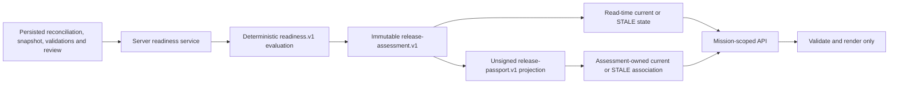

# Readiness and Release Passport Guide

**Audience:** Demo operators, reviewers, developers and future maintainers  
**Status:** `IMPLEMENTED_WITH_CONTROLLED_DEMO_PROOF`; documentation synchronized at `IL-9.3`  
**Evidence:** [EV-READINESS](../evidence/EV_READINESS.json), [EV-PASSPORT](../evidence/EV_PASSPORT.json) and [IL-7.5 proof](../evidence/IL_7_5_TEST_EVIDENCE.md)  
**Evidence date:** 2026-08-06

## Purpose

IntelliLoop readiness is a deterministic, fail-closed assessment of one exact persisted Project/Mission state. A Release Passport is an immutable unsigned reproduction of one persisted assessment. Neither object approves a release, proves that its evidence is true, signs an attestation or authorizes deployment.

This guide is the canonical operator and trust-semantics reference for the implemented Phase-7 workflow. The [domain model](../architecture/DOMAIN_MODEL.md) defines its values, the [API reference](../api/API_REFERENCE.md) defines transport, and the [data guide](../architecture/DATA_AND_MIGRATIONS.md) defines storage.

## End-to-end ownership



The server owns scope and derives every readiness input from repositories. POST commands accept exactly `{}`. The browser verifies and presents complete server resources; it does not evaluate obligations, choose status or construct Passport content.

## Status semantics

| Status | Exact meaning | Does not mean |
|---|---|---|
| `BLOCKED` | At least one current obligation is unsatisfied and no stale-precedence blocker applies | Rejected deployment, unsafe software or a human release decision |
| `READY` | All nine deterministic obligations passed for the assessment's exact persisted inputs | Evidence truth, production safety, release approval, signature or deployment authority |
| `STALE` | An exact current dependency differs from the recorded assessment binding | The historical assessment was rewritten, deleted or necessarily incorrect when recorded |

The UI may call `READY` “candidate READY” to preserve this distinction. Status color is supplementary; text, obligation state and blocker/stale-reason details remain authoritative.

## Nine fixed obligations

| Obligation | Requirement |
|---|---|
| `INTEGRITY_VALID` | The exact reconciliation/impact aggregate has verified canonical integrity. |
| `SCOPE_EXACT` | Every input belongs to the exact Project and Change Mission. |
| `SNAPSHOT_CURRENT` | Evaluated and current Git snapshot identities are equal. |
| `CRITICAL_FINDINGS_CLEAR` | No current conflict, ambiguity, missing support or impact gap remains open. |
| `REQUIRED_VALIDATIONS_PASS` | Every explicitly required validation has one exact current passing result. |
| `EXPLICIT_HUMAN_REVIEW` | A persisted human review binds the exact scope, snapshot and reconciliation result. |
| `DEPENDENCIES_CURRENT` | The exact assessed dependency input remains current. |
| `CANONICAL_INPUTS_ONLY` | No placeholder, unavailable fallback, AI advice or incomplete map supplies readiness authority. |
| `INPUTS_PERSISTED` | Reconciliation, validation and review inputs are persisted authoritative records. |

Missing, unknown, malformed, unpersisted, incomplete, fallback or AI-advisory input fails closed. `FAILED` and `INCONCLUSIVE` validations do not satisfy the validation obligation. An AI-attributed review does not satisfy the human-review obligation.

## Assessment lifecycle

1. A current immutable reconciliation revision and Git snapshot must exist.
2. The API resolves the Mission's owning Project and reconstructs all evaluation inputs from storage.
3. The evaluator calculates the ordered obligations, blockers, status and canonical digests.
4. Exact same-input replay reuses the existing assessment. Changed authoritative input appends a successor revision.
5. Reading any assessment derives current state against live persisted dependencies without updating historical bytes.

`evaluatedStatus` is what the immutable assessment recorded. `currentStatus` is the read-time derived state. A historical assessment can therefore retain `evaluatedStatus: "READY"` while presenting `currentStatus: "STALE"` with ordered reasons. `storedAssessmentChanged` remains false.

## Release Passport lifecycle

1. Select one exact persisted assessment revision.
2. Create or reuse its Passport. Only one Passport can exist per assessment.
3. Projection copies the assessment's scope, snapshot/reconciliation/rule bindings, input digest, evaluated status, obligations, blockers, finding counts, validations, review and structural citations.
4. Projection calculates only Passport identity and digest; it never reruns readiness.
5. Reading Passport state delegates freshness to the owning assessment. A stale association does not mutate the Passport.

Every Passport fixes these authority values:

- `projection: "REPRODUCED_NOT_RECOMPUTED"`;
- `readinessRecomputed: false`;
- `signed: false`;
- `releaseApproval: false`;
- `deploymentAuthority: false`; and
- `aiAuthority: "NONE"`.

The structural JSON download repeats those boundaries, contains no source body, credential or private absolute path, and carries `UNSIGNED_LOCAL_RECORD`, `NOT_RELEASE_APPROVAL` and `VERIFY_CURRENT_STATUS_BEFORE_USE` warnings. It is not a general evidence export.

## Browser operation

1. Start IntelliLoop and complete the supported Project, Mission, snapshot, evidence, Twin, code-map and reconciliation steps.
2. Open `/missions/:missionId/passport` or choose **Readiness and Passport**.
3. Activate **Assess current persisted evidence**.
4. Read status, every obligation, blocker, finding count, validation/review attribution and immutable binding before interpreting the result.
5. Select older assessment revisions to compare recorded and current state.
6. Activate **Create unsigned Passport** only for the assessment you intend to reproduce.
7. Inspect its exact assessment binding, authority statement and structural citations before downloading or printing.

Normal browser users cannot currently create ValidationResult or explicit review records. An ordinary locally created Mission can therefore remain `BLOCKED`. Do not edit SQLite, forge API responses or relabel synthetic records to obtain `READY`; those actions leave the supported trust boundary.

## Failure and recovery

| Observation | Safe response |
|---|---|
| No assessment can be created | Confirm a current Mission, captured snapshot and persisted reconciliation exist; resolve the displayed stable error through supported workflows. |
| Assessment stays `BLOCKED` | Read the unsatisfied obligations and blocker codes. Missing validation/review intake cannot be bypassed in the current browser. |
| Historical item becomes `STALE` | Review stale reasons, capture/reconcile current dependencies and create a new assessment; preserve the historical revision. |
| `INTEGRITY ERROR` | Stop using the affected resource. Restore a trustworthy database or recreate controlled demo state through supported paths; never patch canonical rows. |
| Passport download is rejected | Reload the exact Passport from the local API. Do not construct or repair export JSON manually. |
| API or browser is unavailable | Restore the local API/web processes and retry. Cached or placeholder readiness is never substituted. |

## Reproducible evidence

Run the Phase-7 focused proof from the repository root:

```powershell
npm.cmd run evidence:readiness-passport
```

The proof covers the domain, SQLite repositories, production API routes, browser decoder and focused browser UI. Its controlled matrix has one fully satisfied positive case, 26 non-ready cases and zero false `READY`. It also proves exact Passport equality, close/reopen recovery, Project/Mission isolation, canonical-corruption rejection and zero external provider calls.

These are deterministic controlled-fixture results. They are not production accuracy, performance, business-impact or safety measurements. Phase 8 now supplies the resettable competition fixture and complete judge-facing `BLOCKED → READY → STALE` walkthrough; that demonstration does not widen ordinary validation/review intake or release authority.

## Current boundary

Implemented:

- pure versioned fail-closed evaluation;
- immutable assessment and Passport persistence;
- derived historical staleness without mutation;
- strict Mission-scoped API and browser presentation;
- structural local Passport download/print; and
- generated restart, isolation, integrity, equality and AI-off proof.

Not implemented:

- public validation or review intake;
- evidence authenticity verification or a production safety guarantee;
- waiver, approval or policy-override workflow;
- Passport signature or external attestation;
- deployment integration or authorization;
- live AI/provider authority.

The final Phase-8 fixture/reset workflow is implemented only for the fixed ownership-marked synthetic LoopMart workspace. It is not a general validation/review, repository-reset or readiness-authoring facility.
