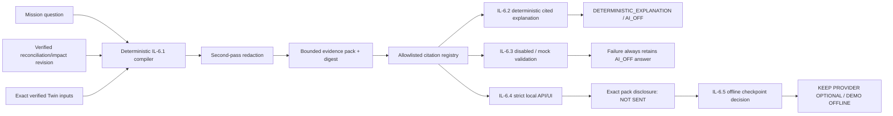

# AI Safety and Data Transfer

**Audience:** Developers, reviewers, demo operators and future provider maintainers  
**Status:** `FINALIZED_IL_6_6`; extended through provider-free `IL-6.7`  
**Current runtime transfer:** `NONE`  
**Finale provider posture:** `OFFLINE`  
**Current outbound provider payloads:** `0`  
**Evidence date:** 2026-08-06

## Reviewer decision record

| Review question | Recorded answer |
|---|---|
| Does the product currently invoke OpenAI or another model provider? | No. Production provider outcome is `DISABLED`; there is no live transport. |
| Did the personal OpenAI checkpoint run? | No. Its exact status is `NOT_RUN_NOT_AUTHORIZED`. |
| Did any evidence pack leave the machine? | No. All six controlled previews are `NOT_SENT`; current outbound provider payload count is zero. |
| What is the frozen course-correction decision? | `KEEP_PROVIDER_OPTIONAL_AND_DEMO_OFFLINE` |
| What will the competition finale demonstrate? | The deterministic `DETERMINISTIC_EXPLANATION` / `AI_OFF` workflow, with cited local evidence and explicit transfer disclosure. |
| Are provider quality, latency or token claims available? | No. Grounding, citation validity, usefulness, latency and usage remain `NOT_MEASURED`. |
| Can AI decide readiness or modify evidence/findings? | No. AI has no canonical-state, finding, readiness or Release Passport authority. |
| What binds this decision? | `sha256:af6f2a073c76671dc4d1924219771a1b058e1658006e8a036c9af1df36305d94` |

This record is the implemented finale posture, not a pending provider task. A later live experiment would require a new explicitly authorized checkpoint that supersedes this digest-bound decision; it cannot be enabled by changing a flag or reusing a signed-in ChatGPT session.

## Current boundary

`IL-6.1` implements a pure evidence-pack compiler/citation registry, `IL-6.2` adds deterministic rendering, `IL-6.3` adds disabled/mock-only provider-neutral validation, and `IL-6.4` exposes the six fixed questions through a strict local API/browser workflow. `IL-6.5` records the mandatory personal-provider course-correction checkpoint through its offline branch. No story through this point adds a database record, live transport, credential lookup or network operation. The browser shows exact redacted pack JSON locally with `transferStatus: NOT_SENT`; no compiled pack, request, response or explanation is transmitted externally by the current product.

The compiler accepts one Mission question, one integrity-checked reconciliation/impact revision, its exact integrity-checked Twin revision, and the complete evidence-source, claim and explicit-supersession inputs represented by that Twin. Cross-Project/Mission scope, a mismatched Twin binding, missing or extra Twin source input, invalid claim lineage and an unmatched supersession dependency fail closed.



## Data disposition and transfer inventory

| Data or artifact | Current location and lifetime | Current provider transfer | Only if a future live branch is newly authorized |
|---|---|---|---|
| One of the six fixed Mission questions | Local request processing and local browser response | `NOT_SENT` | The exact redacted question would be part of the reviewed request. |
| Question-directed redacted evidence pack | Compiled in local process memory and returned for local disclosure; not persisted by the cited-question workflow | `NOT_SENT` | The exact previewed pack—not an unreviewed variant—would be the provider context. |
| Citation registry and request bindings | Local response/request validation data | `NOT_SENT` | Allowlisted citation IDs, request UUID, pack/question/scope digests, schema identity and immutable limits would accompany the pack. |
| Deterministic cited explanation | Computed and rendered locally | `NOT_SENT` | It remains the fallback and comparison baseline; it need not be sent to produce the current demo. |
| Provider request/response | No production instance exists; controlled mock values exist only inside tests | None | A response could be accepted only after identity, schema, citation, usage and authority validation. Raw bodies would not be logged or persisted by default. |
| Provider credential | Absent | None | Runtime-only injection after explicit authorization; never source-controlled, product-persisted, printed or copied into evidence. |
| Safe checkpoint metadata | Versioned repository evidence report | Not a provider transfer | Only status, sizes, safe usage/latency metadata and the exact decision may be retained—never the credential, exact pack, prompt or provider response body. |

### What would leave in a newly authorized live branch

Only the operator-reviewed, second-pass-redacted fixed question and minimized evidence pack plus bounded request metadata would be eligible. Depending on the question, the pack can contain compact source attribution, selected redacted claim excerpts, explicit supersession links, reconciliation findings and cited impact paths. The provider would process that data under the separately reviewed account and provider terms; this repository does not claim those external terms have been approved.

### What must remain local

Credentials, environment values, raw database content, full evidence-source bodies, repository source text, registered absolute paths, pre-redaction bytes, unrelated claims, arbitrary free-form prompts and readiness/Passport state are excluded. Redaction is a control, not proof that arbitrary real data is safe; synthetic or explicitly approved inputs and human preview remain mandatory for any future transfer decision.

## Selection and minimization policy

The versioned `evidence-pack-compiler-policy.v2` first verifies the complete exact Twin-bound input and then selects only the items required for the chosen fixed question:

- one compact assessment binding and count summary;
- compact source attribution cards for selected claims;
- selected claim excerpts and source identities;
- explicit claim-supersession relationships;
- canonical reconciliation findings; and
- canonical cited impact paths.

Release/next-action questions retain every open finding plus referenced claim/path lineage; conflict, impact, missing-validation and post-correction questions retain their exact relevant subsets. Full evidence-source `normalizedContent`, pre-redaction request bytes, repository registration roots, repository source text, database content and environment values are omitted. This is deterministic fixed-rule minimization, not semantic relevance ranking; no model decides what is included. The v2 correction keeps the controlled complete workflow under the frozen 12,000-unit boundary instead of widening it.

## Transfer redaction

The compiler treats persisted redaction as necessary but not sufficient. It applies a second transfer pass to the question and every selected JSON string/key using the existing named secret corpus, including private keys, OpenAI/GitHub/service/Slack/AWS tokens, JWTs, authorization values, URI credentials, generic secret assignments and secret-named JSON values. A separate `PRIVATE_PATH` rule removes Windows absolute, UNC and common private POSIX paths. A redaction collision or malformed/non-canonical value fails closed.

The output records ordered redaction counts and binds them into the pack digest. This fixed corpus is defense in depth, not universal data-loss prevention. Operators must use synthetic or explicitly approved data, inspect any future outbound preview and stop if sensitive content remains.

## Bounds and deterministic identity

| Boundary | Limit or rule |
|---|---|
| Question | 2,048 UTF-8 bytes |
| Pre-transfer item | 16,384 canonical UTF-8 bytes |
| Redacted item | 4,096 canonical UTF-8 bytes |
| Pack items/citations | 256 |
| Serialized pack | 65,536 UTF-8 bytes |
| Provider-neutral token upper-bound unit | 12,000, conservatively measured as one unit per serialized UTF-8 byte |
| Overflow behavior | Reject the complete pack; never truncate silently |
| Ordering | Fixed item-kind order, then canonical logical key |
| Pack identity | SHA-256 over the complete versioned redacted pack document |

Equivalent exact inputs produce the same bytes, pack digest, ordering and citations even when input collections arrive in another order. A changed redacted question changes its question and pack digests without changing citation IDs for unchanged logical items.

## Citation registry

Every pack item has a canonical item digest and exactly one locator containing a version, item kind and stable logical key. The citation ID is derived from that locator, not from model text or array position. The pack exposes the complete `allowedCitationIds` list, and resolution succeeds only when the citation, locator, item identity and item digest agree. Unknown, malformed, duplicated, reordered or tampered citations fail closed.

Stable citation identity does not establish that cited evidence is true, sufficient, current or applicable. It establishes only that an explanation can point to one exact allowlisted pack item.

## Deterministic offline explanation

`offline-explanation.v1` accepts only one verified pack and the six fixed evaluation questions: release, open conflicts, impact, missing validation, next actions and post-correction change. Unsupported free-form questions fail closed. The output separates a cited answer, facts, inferences, conflicts, gaps and next actions. Superseded claims are explicitly historical, and a conflict action requests human review without selecting a winner.

Every statement is non-empty, bounded and carries one or more allowlisted pack citations. The renderer includes only citations it actually used, in pack order. Its invariant check rerenders from the exact pack and rejects changed answer text, structure, ordering, citation, binding or digest. This proves deterministic grounding to a structurally verified pack; it does not establish evidence truth or completeness.

The output engine is exactly `DETERMINISTIC_EXPLANATION` with `AI_OFF`, provider `NONE` and `externalCallMade: false`. There is no readiness field. The release answer explicitly states that the renderer does not decide release readiness even when no open conflict or gap is present.

## Provider-neutral mock boundary

`provider-adapter-request.v1` is constructed internally from a verified pack and canonical request UUID. It includes the exact redacted pack, pack/question/scope bindings, allowlisted citations, closed structured-output JSON Schema, immutable resource limits and canonical policy/request digests. Callers cannot supply an alternate digest, allowlist or provider body.

Execution defaults to `DISABLED`. The only other mode is `MOCK_VALIDATION`, which requires an injected transport explicitly labeled with that kind and safe provider/model IDs. Static boundary tests prove the module imports no fetch, HTTP(S), environment, authorization or credential API. The application config still refuses `INTELLILOOP_AI_EXTERNAL_CALLS=true`.

Mock output is detached through canonical JSON and limited to 16,384 UTF-8 bytes. Exact validation requires request UUID/digest, pack digest, schema version, answer/fact/inference/conflict/gap/action sections, bounded text, at least one allowlisted citation per statement, the exact pack-ordered citation union, safe mock identity and coherent provider-reported usage. Unknown members and any readiness, approval, waiver, Passport or finding-mutation-shaped key reject. Accepted structure receives a validation digest; that proves structural binding, not semantic truth, usefulness or provider quality.

The immutable defaults are one concurrent request, 20 seconds, one retry, 12,000 pack input-token upper-bound units, 1,200 provider-reported output tokens and 50,000 reserved session units. Only timeout and transport failure retry. Disabled, concurrency, budget, timeout, transport, schema, identity, citation and usage failures return the complete deterministic offline explanation with a stable reason and no raw error. No failure makes an external call or creates readiness state.

## Authority matrix

| Surface | May explain or display | May mutate canonical evidence/findings | May decide readiness or Passport | Current execution |
|---|---|---|---|---|
| Reconciliation/impact core | Deterministic facts, findings and cited paths | Only through its explicit versioned domain workflows—not through AI | No | Local deterministic |
| Evidence pack/citation registry | Redacted context and resolvable citations | No | No | Local deterministic |
| Offline explanation | Cited facts, inferences, conflicts, gaps and next actions | No | No | `AI_OFF` |
| Provider-neutral adapter | Structurally validated advisory text in controlled mock tests | No | No | Production `DISABLED` |
| Personal-provider checkpoint | Safe result metadata and one course-correction decision | No | No | `NOT_RUN_NOT_AUTHORIZED` |
| Human reviewer | Review evidence and make decisions in owning workflows | Only through explicit product controls when implemented | Only through the future readiness/Passport workflow | Outside the AI adapter |

## Authority separation

- Deterministic reconciliation and impact structures remain canonical.
- The pack is a redacted transport/context projection, not a finding, readiness assessment or Release Passport.
- `IL-6.2` renders a deterministic cited answer but does not decide readiness, approve release or alter canonical state.
- The provider-neutral adapter exists only as disabled/mock validation. Production wiring always uses disabled mode; there is no live transport or provider credential.
- Product API/UI exposure is implemented locally, validates all response/citation bindings before rendering and records exact `NOT SENT` disclosure.
- The `IL-6.5` personal OpenAI checkpoint is complete as `KEEP_PROVIDER_OPTIONAL_AND_DEMO_OFFLINE`. No explicit transfer authorization or runtime-only credential was provided, so the live branch was not run.
- AI output can never create, mutate, dismiss or waive a finding, validation, readiness state or Passport.

## Course-correction governance

The decision vocabulary is closed to exactly three values:

- `USE_LIVE_PROVIDER_IN_FINALE`
- `CORRECT_PROMPT_OR_EVIDENCE_PACK_AND_RETEST`
- `KEEP_PROVIDER_OPTIONAL_AND_DEMO_OFFLINE`

The third value is selected. It means the deterministic cited workflow is the finale path and a live provider is neither required nor silently pending. It does not claim a provider failed, performed poorly or was evaluated.

### IL-6.5 checkpoint result

`openai-evaluation-checkpoint.v1` verifies passing reconciliation, citation and privacy evidence; the exact six-question set; local redacted previews; `NOT_SENT` transfer state; the unchanged 12,000-unit input ceiling; and disabled production-provider state. It then creates a canonical digest-bound record with exactly one of the three frozen decision values.

For this execution, live-branch authorization was not granted and no runtime credential was supplied or inspected. The selected decision is therefore `KEEP_PROVIDER_OPTIONAL_AND_DEMO_OFFLINE`, and the run status is `NOT_RUN_NOT_AUTHORIZED`. Provider grounding, citation validity, usefulness, latency, input tokens, output tokens and difference from the deterministic explanation are all recorded as `NOT_MEASURED`. Mock-validation and deterministic-baseline results are not substituted for personal-provider measurements.

Generated `EV-OPENAI-EVAL` contains only safe checkpoint metadata, per-question preview sizes and the decision/checkpoint digest. It contains no exact pack body, prompt, provider response, personal identifier or credential. A bounded repository-text pattern scan rejects non-fixture credential-like values; this is defense in depth, not complete secret detection. The stronger boundary is that the checkpoint module and generator import no network, environment or credential APIs.

### Supersession rule

The frozen decision remains controlling unless a later authorized story creates a new versioned checkpoint. That checkpoint must identify the prior digest, obtain explicit transfer authorization, use a runtime-only credential, show the exact redacted outbound body before sending, re-run all validation/privacy gates and record one new allowed decision. Existing evidence must remain immutable. A configuration edit, provider account login, verbal preference or availability of a credential is insufficient by itself.

## Required checks before any future re-opened external transfer

1. Confirm `IL-6.3` and `IL-6.4` validation gates are passing.
2. Keep provider execution disabled unless a new checkpoint explicitly supersedes the frozen offline decision.
3. Compile from one exact verified Mission/Twin/assessment binding.
4. Display and inspect the exact redacted outbound preview and pack digest.
5. Verify size/budget limits and the complete citation allowlist.
6. Inject any credential at runtime only; never write it to source, configuration files, logs, SQLite or evidence artifacts.
7. Validate response request identity, pack digest, schema and every citation before rendering it.
8. Fall back to the deterministic offline explanation on any timeout, provider, schema, digest or citation failure.
9. Record only safe metadata required by the later approved design; never log question/pack/response bodies by default.

## Verification and residual risk

The executable records are [IL-6.1](../evidence/IL_6_1_TEST_EVIDENCE.md), [IL-6.2](../evidence/IL_6_2_TEST_EVIDENCE.md), [IL-6.3](../evidence/IL_6_3_TEST_EVIDENCE.md), [IL-6.4](../evidence/IL_6_4_TEST_EVIDENCE.md), [IL-6.5](../evidence/IL_6_5_TEST_EVIDENCE.md), [IL-6.6](../evidence/IL_6_6_TEST_EVIDENCE.md), [IL-6.7](../evidence/IL_6_7_TEST_EVIDENCE.md), generated [EV-CITATIONS](../evidence/EV_CITATIONS.json) and [EV-OPENAI-EVAL](../evidence/EV_OPENAI_EVAL.json). They prove pack equality/redaction, fixed-question grounding/correction behavior, default-off execution, strict API/client/mock validation, citation and authority rejection, bounded retry/timeout/concurrency/token/session behavior, deterministic fallback, cited synthetic advisory labels/non-authority, the exact offline course-correction decision and documentation/backlog consistency on controlled fixtures.

```powershell
npm.cmd run check:ai-safety-docs
```

This checked contract must pass whenever the checkpoint evidence, provider posture, transfer description, AI-use ledger or implementation backlog changes.

## IL-6.7 synthetic advisory disposition

The new synthetic edge-case set is local deterministic product output, not provider output. It uses only finding/path entries and citations already selected into the exact redacted pack. No additional source content becomes eligible for transfer and current outbound provider payload count remains zero. Generation metadata is fixed to `DETERMINISTIC_RULES`, provider `NONE`, `externalCallMade: false`.

Every entry states `SYNTHETIC`, `ADVISORY_ONLY` and `NOT_EVIDENCE`. AI/deterministic advisory logic may propose a scenario but cannot create an evidence source or validation result, append/resolve a finding, select truth, set readiness or issue a Release Passport. The IL-6.5 checkpoint remains `NOT_RUN_NOT_AUTHORIZED` / `KEEP_PROVIDER_OPTIONAL_AND_DEMO_OFFLINE` and is not superseded by this story.

The proof does not certify arbitrary content as safe, implement a provider tokenizer, prove source truth, validate live-provider semantic answer quality or authorize external transfer. Runtime AI and external network use remain off.
